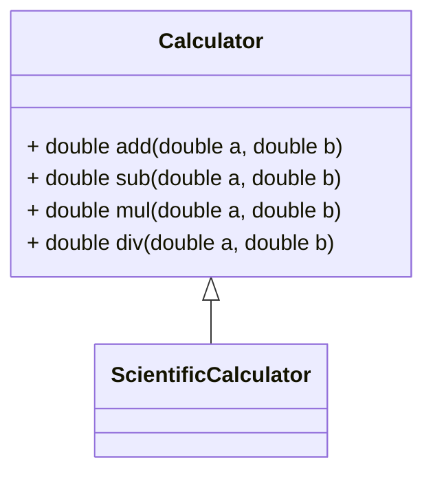

# UML

- [UML](#uml)
  - [Что/Зачем это?](#чтозачем-это)
    - [Пример](#пример)
  - [Сноски](#сноски)

## Что/Зачем это?

UML - Unified Modeling Language - язык моделирования, который позволяет описывать различные аспекты системы, в том числе и ее структуру.

GitHub использует [Mermaid](https://mermaid-js.github.io/mermaid/#/)[^1] - это инструмент для создания диаграмм, которые можно встраивать в markdown.

UML позволяет описывать:

  * Структуру системы
  * Структуру данных
  * Поведение системы
  * Поведение объектов
  * Алгоритмы и др.

### Пример

Вот пример калькулятора:

```cpp
#include <iostream>

class Calculator {
public:
    double add(double a, double b) {
        return a + b;
    }

    double sub(double a, double b) {
        return a - b;
    }

    double mul(double a, double b) {
        return a * b;
    }

    double div(double a, double b) {
        return a / b;
    }
};
```

А это его UML-диаграмма:



## Сноски

[^1]: [Mermaid Live Editor](https://mermaid-js.github.io/mermaid-live-editor/), [Mermaid Documentation](https://mermaid-js.github.io/mermaid/#/)