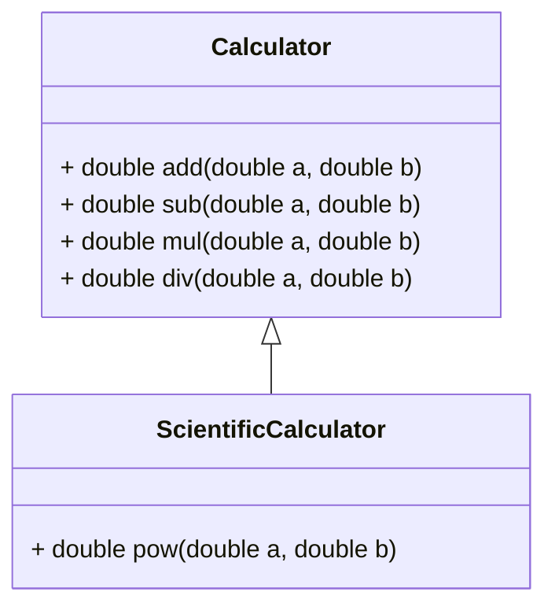
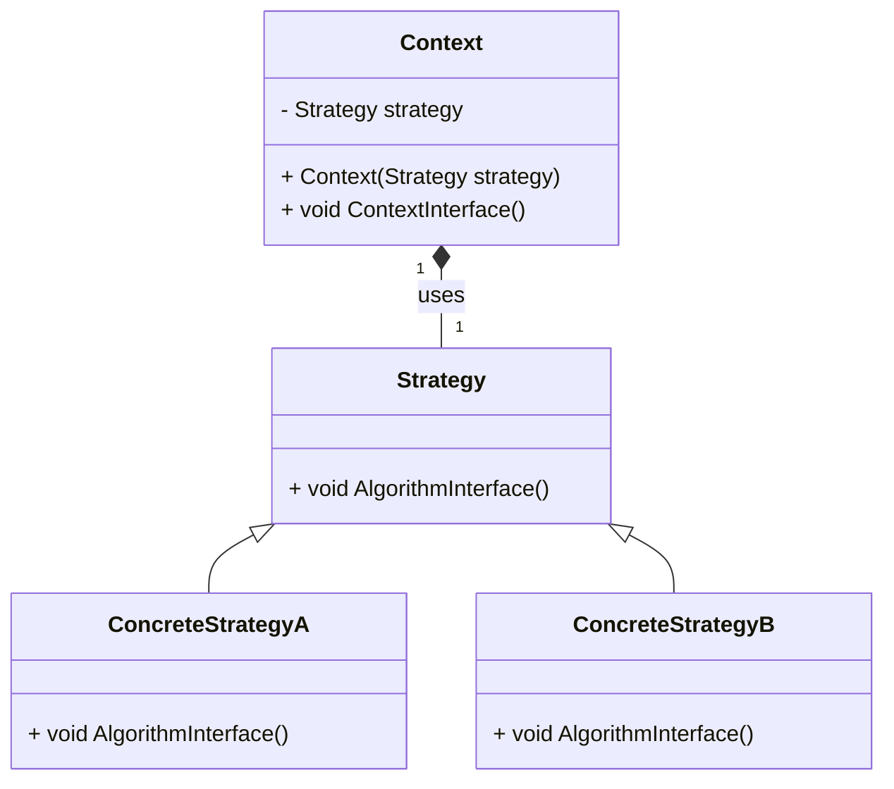
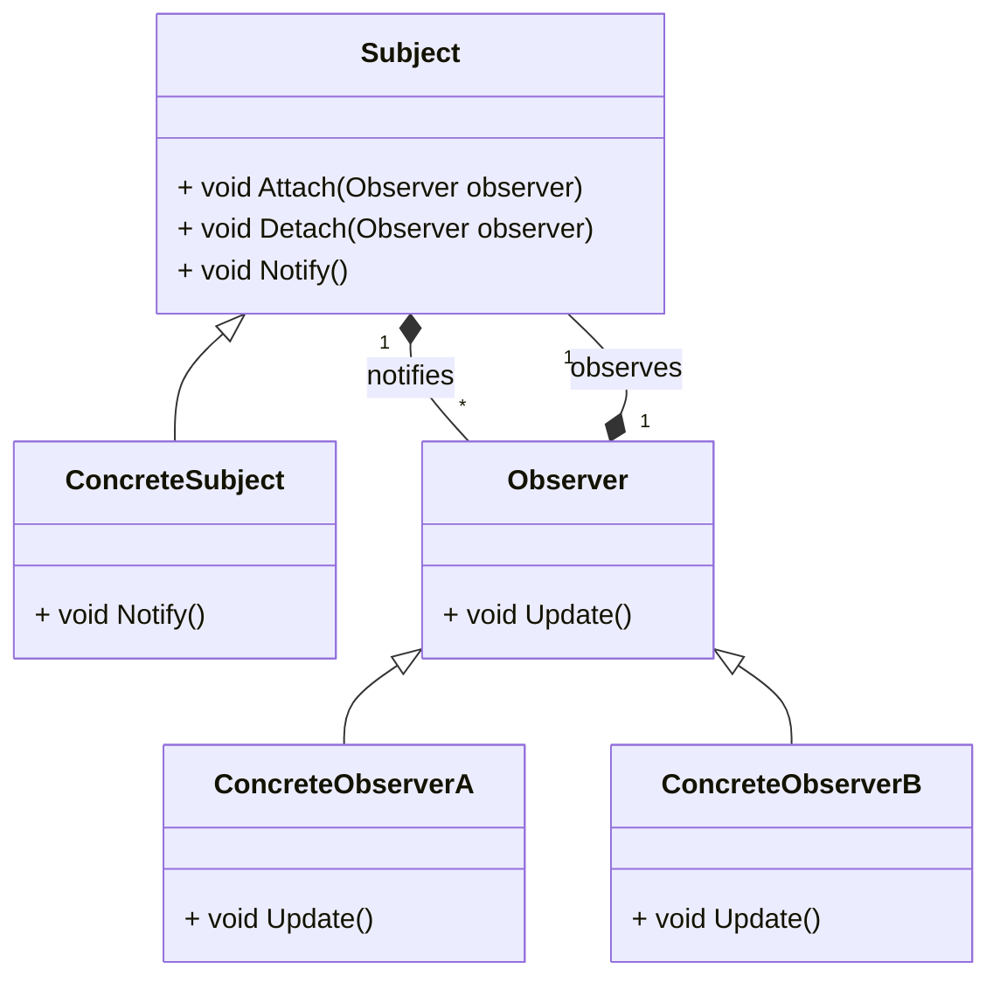
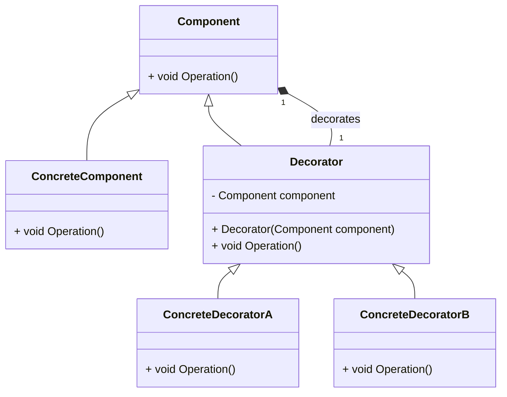
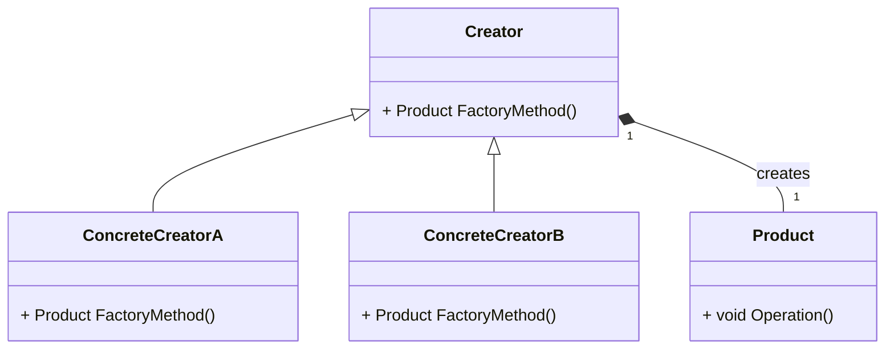
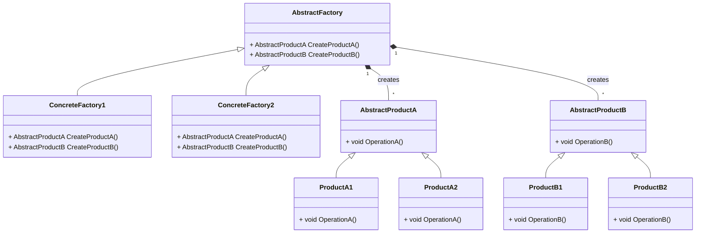

# UML

- [UML](#uml)
  - [Что/Зачем это?](#чтозачем-это)
    - [Простейший пример](#простейший-пример)
  - [UML для некотрых паттернов](#uml-для-некотрых-паттернов)
    - [Стратегия](#стратегия)
    - [Наблюдатель](#наблюдатель)
    - [Декоратор](#декоратор)
    - [Фабричный метод](#фабричный-метод)
    - [Абстрактная фабрика](#абстрактная-фабрика)
  - [Сноски](#сноски)

## Что/Зачем это?

UML - Unified Modeling Language - язык моделирования, который позволяет описывать различные аспекты системы, в том числе и ее структуру.

GitHub использует [Mermaid](https://mermaid-js.github.io/mermaid/#/)[^1] - это инструмент для создания диаграмм, которые можно встраивать в markdown.

UML позволяет описывать:

  * Структуру системы
  * Структуру данных
  * Поведение системы
  * Поведение объектов
  * Алгоритмы и др.

### Простейший пример

Вот пример калькулятора:

```cpp
#include <iostream>

class Calculator {
public:
    double add(double a, double b) {
        return a + b;
    }

    double sub(double a, double b) {
        return a - b;
    }

    double mul(double a, double b) {
        return a * b;
    }

    double div(double a, double b) {
        return a / b;
    }
};

class ScientificCalculator : public Calculator {
public:
    double pow(double a, double b) {
        double res = 1;
        for (int i = 0; i < b; i++) {
            res *= a;
        }
        return res;
    }
};
```

А это его UML-диаграмма:



## UML для некотрых паттернов

- [UML](#uml)
  - [Что/Зачем это?](#чтозачем-это)
    - [Простейший пример](#простейший-пример)
  - [UML для некотрых паттернов](#uml-для-некотрых-паттернов)
    - [Стратегия](#стратегия)
    - [Наблюдатель](#наблюдатель)
    - [Декоратор](#декоратор)
    - [Фабричный метод](#фабричный-метод)
    - [Абстрактная фабрика](#абстрактная-фабрика)
  - [Сноски](#сноски)

### Стратегия



### Наблюдатель



### Декоратор



### Фабричный метод



### Абстрактная фабрика




## Сноски

[^1]: [Mermaid Live Editor](https://mermaid-js.github.io/mermaid-live-editor/), [Mermaid Documentation](https://mermaid-js.github.io/mermaid/#/)